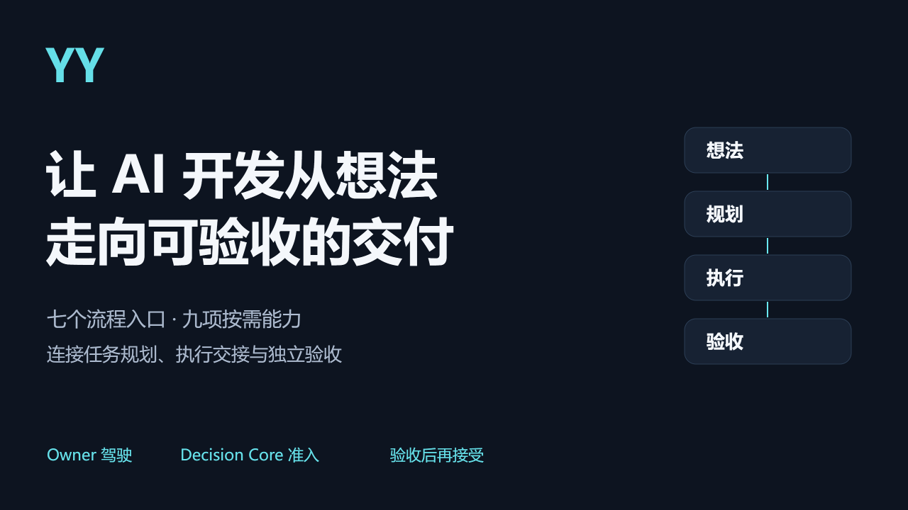
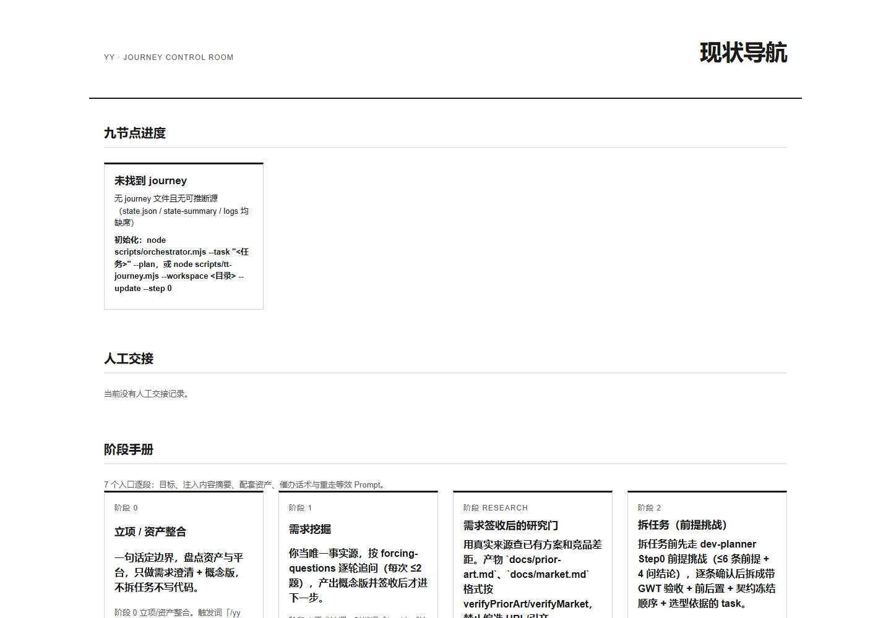

<p align="center"></p>

<h1 align="center">YY：让 AI 开发从想法走向可验收的交付。</h1>

<p align="center">七个流程入口、九项按需能力，连接任务规划、执行交接与独立验收。</p>

YY 是由 Owner 驾驶的 AI 开发编排工作流。你决定目标、边界与是否接受结果；Decision Core 检查当前能否进入下一步、该用哪些能力，宿主 Agent 消费任务与方法后执行。它适合需要持续规划、交接、返工和恢复的软件任务，帮助你把“Agent 说做完了”转化为可核查的产物与证据。

**本地开发用 Skill，远程决策用 MCP，也可以配合使用。** Skill 让有文件与执行权限的宿主按流程开展开发；MCP 让 ChatGPT 等客户端查询准入、选择方法、读取有界资料并核对证据。

## 本页导航

[七入口流程](#七入口流程) · [Skill 与 MCP 怎么选](#skill-与-mcp-怎么选) · [MCP 能做什么](#mcp-能做什么) · [九项按需能力](#九项按需能力) · [关键设计](#关键设计) · [系统架构](#系统架构) · [真实界面](#真实界面) · [安装与配置](#安装与配置) · [快速开始](#快速开始) · [交接验收与恢复](#交接验收与恢复) · [已知边界](#已知边界) · [许可与致谢](#许可与致谢)

## 七入口流程


从 `/yy 0` 开始，也可以回到已有项目当前允许的入口。入口是用户操作，不是承诺自动完成的七次调用。

- **`/yy 0` 立项与资产整合**：明确要做什么、项目边界和可用资源，形成项目概览与资产盘点。
- **`/yy 1` 需求澄清**：把想法变成可确认的规格，留下需求文档与 Owner 确认记录。
- **`/yy research` 真实研究**：查证已有技术、方案和限制，形成带来源与判断的研究证据。
- **`/yy 2` 任务拆解**：把规格拆成可交付任务，明确依赖、阻塞关系与验收条件。
- **`/yy 3` 契约冻结**：固定本批接口、字段与执行边界，留下冻结契约与可追溯依据。
- **`/yy 4` 派单执行**：取得当前任务准入与方法简报，再由宿主执行或显式交接，产出代码、返件与运行证据。
- **`/yy 5` 验收与批判反哺**：核查成果、缺陷与证据，接受任务或带着具体原因返工。

它们分别映射内部 Journey step `0、1、1.5、3、5、7、8`。内部 `2、4、6` 用于回跳修正，没有对应的额外用户命令。准入被拒绝时，先修复缺失的规格、状态或证据，再重新请求决策；不能直接越过检查开工。

[可选交互流程图](assets/yy-workflow.html)

## Skill 与 MCP 怎么选

| 你想做的事 | 选择什么 | 实际由谁完成 |
|---|---|---|
| 在本地项目澄清需求、拆任务、开发、验收和恢复 | Core 包作为 Skill | 有文件访问、Node.js 调用及相应执行权限的宿主 Agent |
| 在 ChatGPT 查询阶段、选择资产、取得方法资料 | MCP 包的 V2 服务 | Python MCP 转发到 Decision Core，以只读工具回包返回 |
| 云端讨论方案，本地完成开发 | 两者配合 | ChatGPT 取得决策；本地宿主重新核验准入、执行并保存证据 |

Skill 是宿主加载的工作方法；MCP 是客户端调用的工具接口。两者共用决策语义。安装 MCP 不要求 ChatGPT 读取本机 SKILL.md，安装 Skill 也不要求启动公网服务。远程查询不会自动变成本机执行权限。

## MCP 能做什么

新连接使用 **`/mcp-v2`**。三个工具分别解决三个具体问题：

- **`yy_stage_decision`：现在能进入哪一步？** 输入 `workflow_id` 与内部 `step`，返回阶段准入、执行相位、阻断原因与 Owner 下一步。缺规格、状态或证据时告诉你先修什么，不替你推进阶段。
- **`yy_task_decision`：这项任务该用什么方法？** `select` 返回路由及主/支持资产；`brief` 在符合准入时装配方法简报，返回来源与内容身份。用 `source_catalog` 与 `source_read` 分页读取一个批准来源，不开放任意文件路径。
- **`yy_validate_consumption`：执行者消费过这份方法吗？** 核对原任务选择/加载的结构证据，并返回可用的执行与行为 checker 观察。缺链报告 `HOST_INTEGRATION_BYPASS`，不能因为回答好听就认证方法论已落实。

云端对话可以取得**真实状态支撑的决策、按任务加载的方法、带身份的资料及可复核证据**，无需每次把九资产全部贴进提示词。工具响应包含 `ok / code / data / evidence / warnings`：`ok=true` 说明查询成功，是否可执行还要看阶段及执行相位。保留原始阻断与错误码，不用模型总结代替回包。

旧 `/mcp` 保留六个兼容读取工具：`yy_open_workflow`、`yy_get_snapshot`、`yy_get_stage`、`yy_list_assets`、`yy_read_asset`、`yy_read_evidence`。它需要额外部署固定的历史源，安装包不自动提供旧工作树；它不是当前阶段权威。新项目使用 V2，不把六加三理解为九资产都在远程执行。

YY MCP 不提供代码写入、命令执行或任意代码文件读取。项目代码由你另行授权的文件工具或 Local MCP 提供；YY 不继承它们的写入权限。多个 workflow 可分别绑定 workspace/session，但 YY × Local 全项目自动授权尚未交付。


## 九项按需能力


YY 将方法文档、条件资源和可执行工具分开管理。Decision Core 先选择适用资产，再按 `METHODOLOGY.json` 解析固定原件和依赖，交给宿主消费。九个资产会按需组合；它们不代表每次同时启动九个 Agent。通过 MCP 取得执行简报也不意味着代码或扫描已执行。

### 规划：从讨论到可以派发的任务

- **planning · 需求澄清与规格形成。** 用 [Matt Pocock 的 grilling / to-spec](https://github.com/mattpocock/skills/commit/24fe0ef7737efae15c87225755e9f6f5965e4888) 整理现有讨论、代码事实和约束；有未决问题才追加 grilling。YY 补充 Owner 确认和本地产物交付，规格写入 `artifacts/specs/`。适合“这个需求究竟要做什么、怎样算完成”；任务分解随后交给 dev-planner。
- **dev-planner · 任务拆解与依赖规划。** 组合同一固定版本的 **to-tickets**，缺规格时补 to-spec，有未决问题时补 grilling。按 tracer-bullet 方法拆出可独立验收的任务，并明确谁阻塞谁，输出到 `artifacts/tickets/`。需要时运行 YY 的 plan-review 检查。远端 issue 发布需要另外授权。

### 实施：把方法和任务交给真正的执行宿主

- **implementation · 受控代码实现。** 采用 Matt 的 **implement → tdd + code-review**，TDD 进一步引用 **codebase-design** 的模块设计方法。YY 将唯一子任务、父任务背景、冻结契约、原件引用与验收标准组装为执行包，默认由当前宿主执行；OpenCode/Cline 等外部 Provider 需要显式选择。有真实产物和消费证据才记录执行，缺执行器则返回 `BRIEF_ONLY`。
- **frontend-design · 分级前端设计。** 结合 [Taste Skill](https://github.com/Leonxlnx/taste-skill) 的 Design Read、设计差异/动效/密度三拨盘，以及源自 [UI/UX Pro Max](https://github.com/nextlevelbuilder/ui-ux-pro-max-skill) 并保留出处的本地设计资料目录。通过 `search.py` 查询真实配色、字体、风格与 UX 资料，通过 `frontend-quality-gate.mjs` 检查静态代码约束。小修、标准页面和全设计分别使用 L1/L2/L3；无界面产物不加载。当前派单方仍须声明分级，Core 尚未自动强制全部裁剪规则。shadcn/ui 是可选组件底座，Bolt 是显式原型任务的可选工具，均不因引用就自动运行。

### 质量验证：报告必须说明检查了什么

- **be-validator · 后端接口契约校验。** 实际 adapter 调用 [Stoplight Spectral](https://github.com/stoplightio/spectral)（锁定 CLI 6.16.3），用随包 OAS 规则检查 OpenAPI JSON/YAML，生成 `contract-result.json` 的规则、严重度及路径结果。资产另有 Zod 与 RFC 9457 的接口设计指导。文字说明、非 OpenAPI JSON 和未确认草案不能充当已校验契约；OpenAPI lint 也不等于接口功能测试。
- **security · 代码安全核查。** 当前主 adapter 调用 [Semgrep](https://github.com/semgrep/semgrep)，使用 YY 的六条 Python 规则检查硬编码密钥/密码、SQL 字符串拼接、MD5、eval 和 shell 子进程等风险，返回 `security-result.json`。显式非 Python 目标被拒绝；混合目录保留未覆盖语言，不能宣称整体通过。主 adapter 当前不运行 gitleaks，也没有全语言安全保证；审计、修复和后端专项核查说明是进一步的方法指导。
- **skill-sentinel · 第三方 Skill 安全扫描。** 当前实际引擎是 [Cisco Skill Scanner](https://github.com/cisco-ai-defense/skill-scanner)（评估固定版本 2.1.0；安装包名 `cisco-ai-skill-scanner`）。adapter 执行扫描、保留 JSON、分析器和 policy 指纹；必需的静态分析器缺失或任何分析器失败时，结果为失败/`UNVERIFIED`。适用于导入第三方 Skill 和社区资产前审查。旧正文提及的 `python -m skill_sentinel` 和 SkillSpector 不是当前可运行主引擎；空发现也不是无风险保证。
- **review · 证据锚定评审。** 变更评审用 Matt 的 **Standards / Spec 双轴 code-review**，必须提供固定 base；存量代码审计使用 YY 补充方法，必须提供范围和版本。结果以七要素发现组织，可按需补后端行为证据。缺锚点会拒绝准备评审，缺实际独立 Reviewer 记录不能把自检写成独立验收。

### 可选治理：只为确实需要的发布和迁移启用

- **sdlc · 发布与迁移治理。** 保留 [BMAD Method](https://github.com/bmad-code-org/BMAD-METHOD) 相关的阶段输入/输出参考和 YY 的阶段记录、角色放行、回滚决策。默认关闭；必须同时有 `explicit_assets=sdlc`、授权引用和受支持的发布/大型迁移/多阶段治理范围。默认仍由宿主消费，[Cline](https://github.com/cline/cline) 仅是显式选用的外部 Provider。模板和角色文档不等于已运行多个 Agent，也不构成另一套 Journey 或 DAG。

Matt 原件固定在上述 commit 并保留 `MIT` 许可证；方法与依赖按声明解析，不在运行时自动追随上游更新。其他上游项目链接说明真实工具来源或方法参考，YY 当前能力以随包 adapter 和固定资料为准。方法投递可验证，完整方法应用认证（C5）仍待交付。

## 关键设计

**先决策，再执行。** Journey 允许进入某阶段，不等于执行相位允许开工。Decision Packet 同时给出阶段判断、资产选择、阻断原因和 Owner 下一步；已有真实计划但执行状态缺失或损坏时，会阻止执行。

**把任务与方法一起交给执行者。** 当前子任务描述是唯一执行任务，父任务作为上下文；按需方法与验收要求分别投递。显式能力属于主资产，支持资产不会被广播成同一角色。

**人工交接仍属于原任务。** 预算、权限、允许输入与固定 checker 先由本端批准；返件经导入、检查和当前版本核对后才接受，继续原任务而不是另起一条失联的流程。

**不直接相信完成声明。** 返回者自报成功不能替代 checker 证据；需要独立验收时，必须有可验证的独立性依据。检查通过、Owner 接受与方法论已验证是不同的事实。

## 系统架构


C4 是薄宿主接线：读取意图映射，调用 Decision Core 的阶段判断；需要资产的阶段再取得任务简报。资格、路由与资产选择由同一个 Core 负责。宿主必须展示并消费 Decision Packet，执行前再次核验。

Core 的核心运行与 CLI 使用 **Node.js / ES modules**，Journey、计划、交接与证据使用项目内文件保存。**Webview** 是 HTML/CSS/JavaScript 页面，用于查看阶段、资产和复制操作话术；它不代替准入。

可选 **Python MCP 服务**提供接入面：M1 保持六工具兼容读取，V2 保持三工具决策与受控资料读取。两者位于接入边界，九资产不会通过 MCP 自动同时运行。Spectral、Semgrep 与 Cisco Scanner 分别承担上述明确范围的检查。

[可选交互架构图](assets/yy-architecture.html) · [可编辑 C4 分解视图](docs/architecture/index.md)

## 真实界面



这是当前发行源码在独立空工作区启动的**真实 Webview 截图**，不是设计稿。页面可查看七入口、九资产与下一步话术；复制按钮实际复制对应入口的提示词。空工作区不会伪造业务执行成功，也不会创建计划或执行状态。

最小可复现演示是下面的只读准入查询：你提供项目目录和入口，YY 返回判断及下一步。真实业务开发还需要按阶段补齐需求、研究、契约和执行绑定。

## 安装与配置

正式版 **v0.3.0**：[Core 包](https://github.com/SHlTbro/YY-workflow/releases/download/v0.3.0/yy-core.zip) · [MCP 包](https://github.com/SHlTbro/YY-workflow/releases/download/v0.3.0/yy-mcp.zip)。MCP 包包含 Core 并额外提供 Python 接入。发行页提供 SHA256SUMS 与构建身份。

先准备 Node.js（实测 24），下列命令在解压后的 `yy/` 根目录运行：

```sh
npm ci --ignore-scripts
node scripts/validate-structure.mjs
node scripts/build-decision-authority.mjs --check
```

预期结构与 Decision 身份检查通过。只有 MCP 包额外执行 `node scripts/build-decision-transport.mjs --check`；Core 没有 Python transport 源文件，不能重算该身份。Windows 带空格路径已实测，其他平台未实测。

### A. 本地 Skill：让宿主加载 YY

1. 解压 Core 包，保持 `SKILL.md`、`commands/`、`scripts/`、`contracts/`、`reference/`、`vendor/` 的相对路径。不能只复制一张 SKILL.md。
2. 使用能读取文件和调用 Node.js 的宿主，如本地 Codex。将整个 `yy/` 放入该宿主支持的 Skill 发现目录，或直接要求读取入口。自动发现目录依宿主而定。
3. 替换以下两处绝对路径，在宿主对话中发送：

```text
请读取 <YY解压目录>/SKILL.md 并按 YY 工作流工作。
业务项目是 <项目绝对路径>，不要把 YY 安装目录当作业务工作区。
/yy 0
我要给现有后端增加健康检查端点。
先盘点边界与可复用资产，展示 Decision Packet 和下一步。
需求与验收条件确认前，不修改业务代码。
```

第一次应得到立项判断与下一步，然后用 `/yy 1` 澄清需求。有执行权限的宿主才负责后续实现。命令文件是宿主指引，不保证每个客户端都把 `/yy` 注册成原生按钮；不识别时明确读取入口。

不要同时安装两个同名 YY。根 npm 安装不会装齐 Semgrep、Cisco Scanner 的 Python 依赖；工具按具体任务的声明安装，依赖缺失不能当通过。

### B. MCP：部署一次，客户端按工具调用

下载 MCP 包。下面是**本机只读 smoke**，只创建空的合成工作区，不打开真实项目。先安装 Python 3.12 并确认 `python --version`，然后从 `yy/` 根目录在 PowerShell 7 执行（UTF-8 无 BOM）：

```powershell
Set-Location integrations/yy-web-mcp
python -m venv .venv
.\.venv\Scripts\python.exe -m pip install -r requirements.txt

$demoRoot = Join-Path $PWD 'demo-workspace'
New-Item -ItemType Directory -Path $demoRoot -ErrorAction Stop | Out-Null
@{
  schema = 'yy/read-bindings@1'
  workspaces = @(@{
    workflow_id = 'yy-demo'
    workspace_root = $demoRoot
    session = $null
    scope = 'synthetic'
    enabled = $true
  })
} | ConvertTo-Json -Depth 5 | Set-Content -Encoding utf8 bindings-demo.local.json

$env:YY_DECISION_ENABLED = 'true'
$env:YY_READONLY_ENABLED = 'false'
$env:YY_READONLY_BINDINGS = (Resolve-Path bindings-demo.local.json).Path
$env:YY_DECISION_ROOT = (Resolve-Path ../..).Path
$env:YY_AUTH_MODE = 'none'
.\.venv\Scripts\python.exe server.py --port 18200 --auth-mode none
```

选择空闲端口，避开 Local 的 8168。服务保持前台运行，V2 URL 为 `http://127.0.0.1:18200/mcp-v2`。用 MCP Inspector 或支持 Streamable HTTP 的本机客户端连接，应能 initialize 并看到三个工具。关闭该前台进程即可结束；重复演示先选择新的空目录，不覆盖已有项目。

`workflow_id → workspace_root/session` 由服务端登记，客户端不能提交任意磁盘路径。synthetic 只用于批准的合成数据；真实项目用 production 与 OAuth，不能把私人项目改名为 synthetic。

#### 在 ChatGPT 中连接

ChatGPT 网页端需要它能访问的远程 HTTPS URL，不能连接你电脑的 127.0.0.1。部署者须保持 YY 服务与 HTTPS 隧道运行，URL 指向 `/mcp-v2`；隧道只解决网络连接。

按 [OpenAI 当前自定义 MCP 说明](https://developers.openai.com/api/docs/guides/custom-mcp-server)，打开 ChatGPT Plugins/自定义连接页面，新增自定义 MCP 服务，填名称 `YY-V2` 与自己的 Server URL，配置认证后创建并安装；在输入框键入 `@` 选择 YY-V2。账号/工作区权限与界面名称以官方页面为准。

- 只有批准的公开合成测试才可选择 No Authentication，部署者必须保证绑定与资料范围隔离。本版不附带本机临时 NoAuth profile，不能把本机演示当作通用匿名上线保证。
- 真实项目复用已有 OAuth：配置 `YY_AUTH_MODE=oauth`、`YY_AUTH_SECRET`、`YY_AUTH_PASSWORD_HASH`、`YY_AUTH_ISSUER`，客户端选 OAuth。签名密钥至少 32 字符；密码是 `auth.hash_password` 编码；issuer 等于服务 HTTPS 源地址。值只存在受控本机环境，不写源码或聊天。

配置好可信绑定与认证环境后，在 integration 目录可用现有 Windows lifecycle：`./start-yy-mcp.ps1 start -Port <空闲YY端口> -BindingsPath <本机绑定JSON绝对路径> -AuthMode oauth -NoTunnel`。它启动本地服务；公网 HTTPS 按自己的隧道配置部署，不自动选择域名、注册项目或安装依赖。

### MCP 第一次实际调用

在 ChatGPT 选择已安装的 `@YY-V2` 后输入：

```text
调用 yy_stage_decision：workflow_id="yy-demo"，step=0。
展示原始准入、阻断原因和下一步，不执行代码。
再调用 yy_task_decision：workflow_id="yy-demo"，
task_text="Implement a small backend health endpoint"，
mode="select"，capability="code-implementation"。
说明主资产与支持资产职责，不声称已经实现。
```

空工作区的 step 0 返回立项判断；第二个查询返回实施任务路由。不会创建计划或写代码，也不会加载全部九资产。yy-demo 必须是当前服务端实际登记的 ID，不能直接拿到另一个部署使用。

已有项目进度后，先查阶段，允许时再用相同内部 step 和 `mode="brief"` 取得方法简报。七命令对应 `0、1、1.5、3、5、7、8`；例如 `/yy 2` 是 `step=3`，不是数字 2。查询不会替你推进 Journey。

读取方法原文时，从 brief 的 source catalog 取逻辑 ID、来源哈希和快照，按工具 schema 填 `source_read` 的 `workflow_id / asset_id / source_id / expected_source_sha256 / snapshot_ref / cursor / max_bytes`。后续页使用返回 cursor，保持外层任务及 step 相同。身份变化或拒绝时停止，不编造 source ID 或反复重放第一页。

执行后才用真实 subtask_id 调用 yy_validate_consumption。空项目没有 receipt，被拒绝是正常结果。开发动作由本地 Skill/宿主执行；远程 MCP 查询本身不会启动编程。

### 从 ChatGPT 交给本地宿主

把实际返回的 Decision Packet 和 brief 交给已加载 YY Skill 的本地宿主，可使用这段话：

```text
这是同一任务的远程决策包与方法简报：<粘贴实际回包>。
本地业务项目：<项目绝对路径>。
请先重新核对当前阶段、项目与 session 绑定及决策身份。
若执行准入不允许，展示阻断和恢复下一步；允许后再按简报执行。
保留产物与证据，返回验收，不把远程查询当作完成证明。
```

这是显式人工交接，不是 ChatGPT 自动远程执行本地代码。另一个 Local MCP 的代码读取需要单独认证与项目授权，YY 的 workflow 绑定不会继承它的写入或执行权限。

## 快速开始

在已解压的 YY 目录中，对一个**已经存在的空测试目录**运行：

```sh
node scripts/host-adapter.mjs prepare --workspace "<测试项目绝对路径>" --intent "/yy 0"
node scripts/host-adapter.mjs prepare --workspace "<测试项目绝对路径>" --intent "当前进度"
```

第一条返回立项阶段的 Decision Packet；第二条只查询进度，`execution_permitted=false`，不会授权业务执行。这两条没有 `--save`，不会保存执行许可。出现阻断时，读取 Owner 说明，按它提示的缺项恢复。

随后让已加载 YY 的 Agent 处理一个具体想法，例如：

```text
/yy 0
我要给现有后端增加一个健康检查端点。
先盘点项目边界与可复用资产，返回立项结果和下一步。
在需求和验收条件确认前，不要修改业务代码。
```

这是使用示例，不是本批已经执行过的后端开发结果。立项后用 `/yy 1` 确认规格，再按需要研究、拆任务和冻结契约；`/yy 2` 会先取得阶段准入，再取得 dev-planner 简报。CLI 无宿主执行回调时只提供简报；Agent 不能因此声称代码已经完成。

## 交接验收与恢复

选择人工模式时，先准备本端批准的交接配置，明确预算、权限、允许输入、验收条目和固定 checker，再运行：

```sh
node scripts/handoff.mjs preview --workspace "<项目绝对路径>" --plan-id <计划ID> --task-id <任务ID> --config "<批准配置.json>"
node scripts/handoff.mjs prepare --workspace "<项目绝对路径>" --plan-id <计划ID> --task-id <任务ID> --config "<批准配置.json>"
```

`preview` 不写业务状态；`prepare` 经决策展示和本端登记后等待返回，旧 Provider 配置不会替人工模式偷偷执行。把交接包交给外部执行者后，在原项目请求：

```text
导入原任务的返件，按本端批准且固定的 checker 验证。
核对当前快照和版本后再接受；补丁整合后重新验证。
成功后 resume 原计划。失败请列出具体差异，不重建状态或伪造 receipt。
```

真实生产消费者提供导入、验证、版本核对与接受链路，已有人工交接→返回验收→resume 证据。当前方法不会把未知远端过程或费用填成零。状态损坏、应有执行状态却缺失、返件版本过期时先恢复对应证据或拒绝返件；真正无计划的立项不因此被误拒绝。

## 已知边界

- YY 提供编排、准入与证据链，不保证模型一定写对代码，也没有已证实的强模型收益或实际 token 费用节省数字。
- 当前可用的是宿主执行接线与人工闭环；原生子代理真实绑定仍是独立后续交付门。
- 当前执行与行为证据属于已有机制。C5 / Receipt v2 方法论验证延期，`methodology_application=UNVERIFIED`；不能据此宣称已完成 APPLIED 或 VERIFIED。
- MCP 工具只读，受控 `source_read` 受绑定、授权和范围限制。它不会提供任意工作区访问权限。
- 前端完整分级策略、跨语言安全覆盖和真实 API 联调不能由现有静态门替代。
- 历史完整回归保留 **50 PASS / 1 FAIL / 1 SKIP**；本批安装和受影响确定性检查另行验收，不能把历史记录改写成全绿。
- 发行包提供执行闭包；开发用完整回归测试不在安装包中，不能直接把 package.json 中全部开发脚本当作随包可运行命令。本次发布未运行付费模型评测。
- 本机临时 NoAuth synthetic 测试部署不属于本版可移植发行配置；真实项目访问仍要求身份、可信绑定与单独授权，多项目只读接入尚未开放。

## 许可与致谢

YY 根许可为 [`MIT`](LICENSE)。运行资产保留各自的上游许可、原件及来源声明；其中 skill-sentinel 保留 `Apache-2.0`。根许可不替代第三方许可。

感谢 Matt 方法资产及其他上游项目。原版权、工具与展示材料归属见 [第三方声明](THIRD_PARTY_NOTICES.md)；本页不把历史执行内核名称作为当前产品功能。

可编辑视觉源：[主视觉 SVG](assets/yy-hero.svg) · [能力图 SVG](assets/yy-assets.svg)。

已公开的[发行进度记录](docs/progress/2026-10-10.md)保留历史展示；当前使用方式以上述指南为准。
