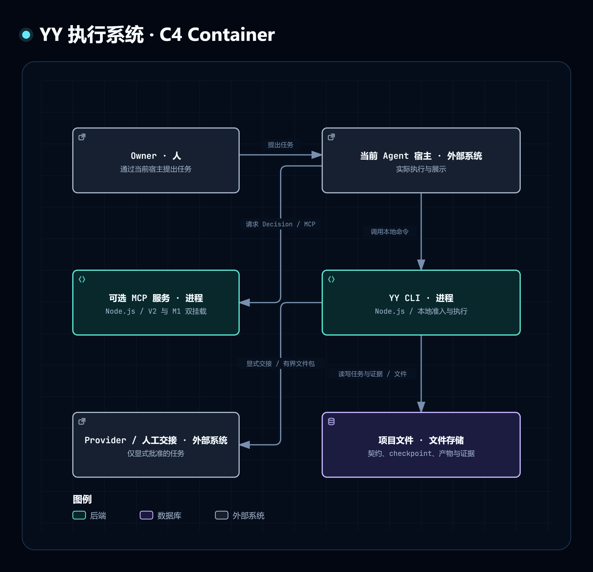

# YY 的实际运行与存储边界

这是 C4 Container 层：本地 Node.js CLI 入口、可选 Node.js MCP 服务，以及项目文件存储。Decision Core、宿主 adapter 和九项方法资产是进程内模块或文件，不是独立部署容器。两条调用入口按需要使用，不代表必须同时运行。

| 发起方 → 接收方 | 行为与技术 | 当前事实来源 | 状态 |
|---|---|---|---|
| Owner → 当前宿主 | 提出任务；具体交互由宿主提供 | `SKILL.md`、`commands/` | 当前入口 |
| 当前宿主 → YY CLI | 调用本地 Node.js 命令，展示与复核准入 | `scripts/host-adapter.mjs`、`scripts/lib/host-adapter.mjs` | 当前实现 |
| 当前宿主 → 可选 MCP 服务 | 请求 Decision；MCP transport | `reference/decision-interface.md`、`README.md` | 可选实现；V2 当前决策，M1 旧读取 |
| YY CLI → 项目文件 | 读写契约、checkpoint、产物与任务证据；文件系统 | `README.md`、`reference/decision-interface.md` | 当前实现；写入须满足各入口条件 |
| YY CLI → 可选执行方 | 显式交接；有界文件包或明确的外部调用 | `reference/manual-handoff.md`、`reference/host-execution.md` | 显式批准的条件路径 |

实线表示有方向的调用或文件操作；外部系统不展开内部结构。本图不声明生产部署拓扑、多个实例、模型供应商或网络地址。文件存储是实际持久化边界，不使用无源码依据的数据库名称。

[交互 HTML](c4-containers.html) · [编辑 JSON](c4-containers.json) · [C4 Mermaid](c4-containers.mmd) · [返回资料索引](index.md)
