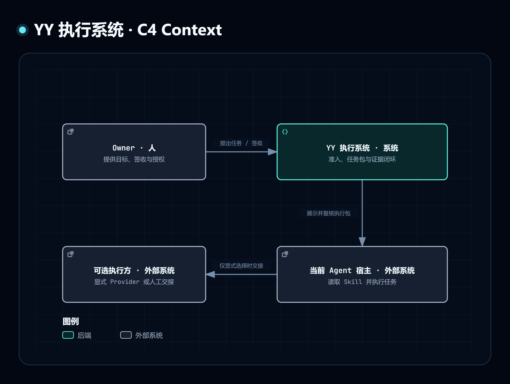

# YY 执行系统的外部关系

这是 C4 Context 层：YY 执行系统、Owner、当前 Agent 宿主和可选外部执行方。宿主与外部执行方保持黑盒，图中不猜测其模型或内部部署。

| 发起方 → 接收方 | 行为与技术 | 当前事实来源 | 状态 |
|---|---|---|---|
| Owner → YY | 通过宿主提出目标、签收与授权；宿主交互方式依平台 | `SKILL.md`、`commands/` | 当前方法与入口 |
| YY → 当前 Agent 宿主 | 交付并复核执行包；本地 CLI / 可选 MCP | `reference/decision-interface.md`、`reference/host-execution.md` | 当前实现；执行依赖真实宿主绑定 |
| 当前 Agent 宿主 → 可选执行方 | 仅显式选用时交接；有界任务包 | `reference/manual-handoff.md`、`reference/host-execution.md` | 条件路径；不默认执行 |

实线表示有方向的请求、交付或控制关系。方法文件不是运行系统；本图的 YY 边界涵盖可调用工具与它们携带的方法数据。

[交互 HTML](c4-context.html) · [编辑 JSON](c4-context.json) · [C4 Mermaid](c4-context.mmd) · [返回资料索引](index.md)
