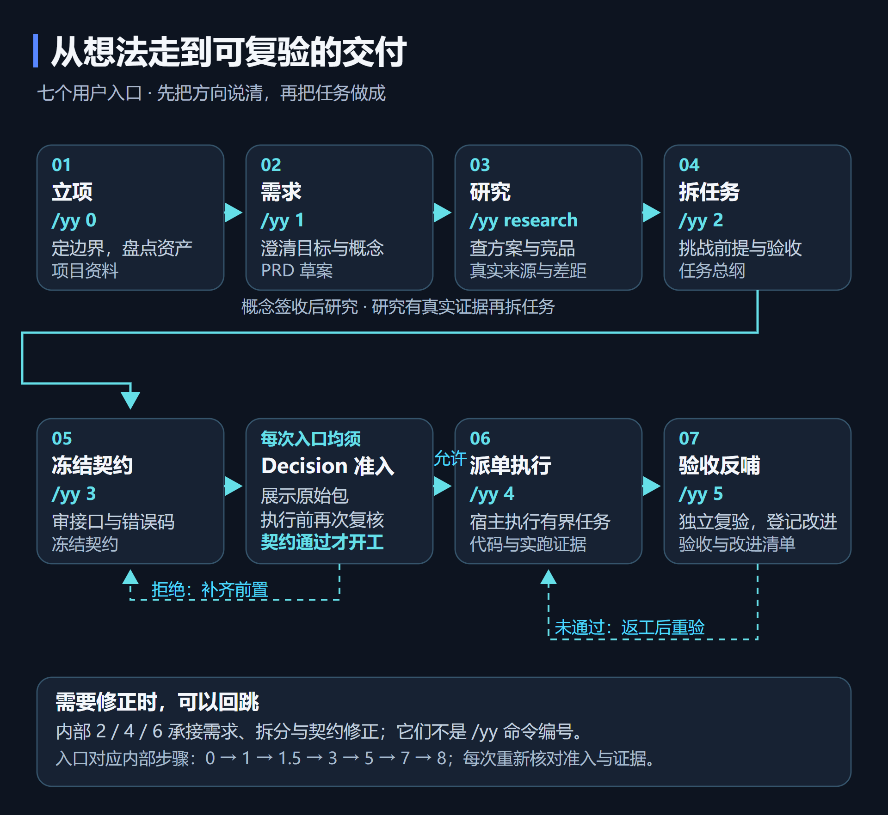
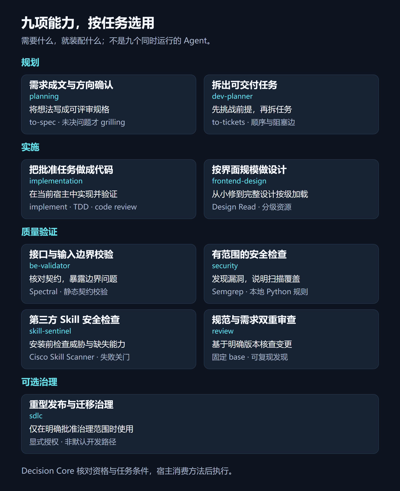
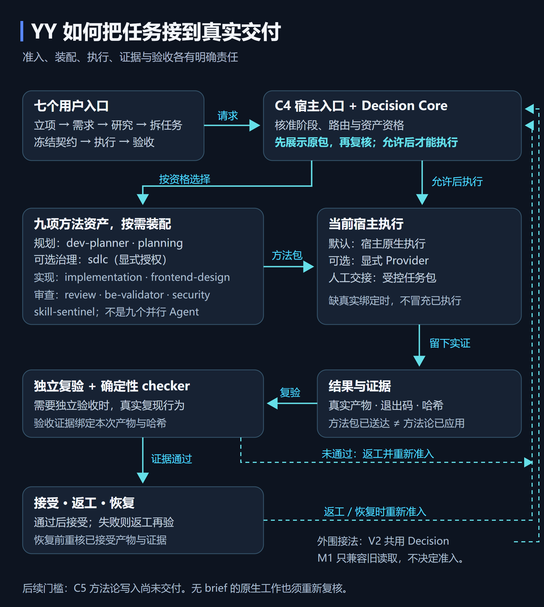

# YY 进度快照 · 2026-10-10

**YY：让 AI 开发从想法走向可验收的交付。**

七个流程入口、九项按需能力，连接任务规划、执行交接与独立验收。

> 这是 Preview 进度发布，不是稳定软件升级。下列实现与验收来自本地当前工作流及隔离发行候选；远端源码仍保留原有历史实现，本次只提交进度文档和展示图片。不要把 GitHub 自动生成的源码归档当成下列新版运行包。

## 工作流与能力

YY 由 Owner 决定目标、边界与是否接受结果。Decision Core 判断阶段准入、执行相位、资格和资产选择；宿主展示并消费决策后执行。返回结果需要运行与检查证据，Agent 自报完成不能替代验收。

七入口是 `/yy 0` 立项、`/yy 1` 需求、`/yy research` 真实研究、`/yy 2` 拆任务、`/yy 3` 冻结契约、`/yy 4` 派单执行、`/yy 5` 验收反哺。对应内部步骤 `0、1、1.5、3、5、7、8`；内部 `2、4、6` 为回跳层，不是额外用户命令。

- 规划：planning 形成并确认规格；dev-planner 拆任务及依赖。
- 实施：implementation 实现批准任务；frontend-design 按界面规模加载设计方法。
- 质量验证：be-validator 检查接口契约；security 检查当前覆盖范围内的安全问题；skill-sentinel 检查第三方 Skill；review 分别核对规范与需求。
- 可选治理：sdlc 仅在显式授权的大迁移、发布或多阶段治理中启用。

九资产按需装配，不是九个同时运行的 Agent。当前静态检查也不替代真实 API 联调、跨语言安全覆盖或视觉质量验收。

## 已完成与验证范围

| 项目 | 当前证据与范围 |
|---|---|
| State Absence P1 | 已接受最小修复；有适用真实计划而状态缺失时拒绝执行，真正无计划行为保持 |
| S10 | 当前静态量尺 13 文件通过；没有宣称实际 token 费用节省 |
| 展示返工 | 单页 README、四张正式静态图、可编辑图源和真实前端截图完成；桌面/窄屏、明暗主题实查及独立读者理解通过；Owner 视觉验收待完成 |
| 隔离发行候选 | Core/MCP 隐私与许可检查、带空格路径搬迁、两次复建字节一致性通过；正式源码整合与不可变运行包发布仍待完成 |
| 安装验收 | 最终候选真实 fresh-clone 六步通过，30 项相关测试通过；完整 Showcase 门与本地打包通过 |
| YY MCP | M1 六工具、V2 三工具保持只读；临时无 OAuth 配置仅允许批准的 synthetic workflow，未批准 raw source_read 拒绝 |
| 生命周期 | owned 服务与隧道分别重启/重连后实际恢复；固定 endpoint 保持，单实例守护与退避重试启用；不宣称长期稳定性已认证 |
| YY × Local | 17 项项目映射提案逐项关闭，复用现有 trusted binding；本地隔离代码闭环通过，云端公共合成上下文与越界拒绝通过 |

YY × Local 的云端测试没有读取私人项目内容。代码读取、写入拒绝及重启恢复的完整测试使用隔离只读 fixture，不能把它升级为受保护真实项目云端验收。项目注册不等于云端授权，Local 原有写权限不向 YY 继承。

## 仍未完成的门

- 真实项目的调用者身份、逐项目授权和受保护 Local 只读连接面尚未验收，真实 YY 项目绑定保持关闭。
- 原生子代理真实绑定是独立后续交付门。
- C5 / Receipt v2 方法论验证继续 **DEFERRED**，`methodology_application=UNVERIFIED`。
- 历史完整回归保留 **50 PASS / 1 FAIL / 1 SKIP**；本轮没有重跑完整回归，也没有将它改写成全绿。
- 无付费模型评测；没有强模型收益或费用下降的实测结论。
- Windows 搬迁与安装已实测，其他平台未扩大保证。手机上的复杂图细字需放大，正文提供完整说明。

## 发布边界

本次只公开上述进度与展示候选图片。私有项目列表、工作区路径、workflow 注册表、凭据、网络端点、本机运行状态和调试原始回包没有进入本次变更。

运行资产遵循各自上游许可；本快照图像未重新分发字体文件。原项目许可证及上游 copyright 保持。
