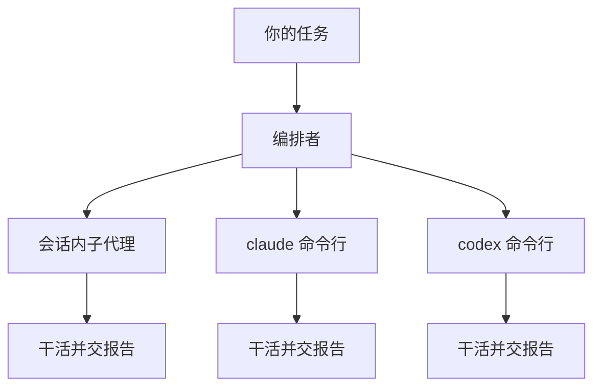

# 决策卡（Decision Card）模板 — ON-1 批 0

> 用途：编排者在**需要 Owner/用户拍板**的时刻，用一张卡把"决定什么、为什么现在决定、有什么选项、默认建议什么"说清楚。
> 格式纪律：大白话（禁术语堆砌，首次出现的名词就地一句话解释）；每段字段名固定，便于机器定位；
> mermaid 源码由 agent **生成**（不手写硬编码），改动点用 `classDef highlight` 高亮；
> 终端不渲染 mermaid 时回落 ASCII 图（AskUserQuestion 的 option/preview 字段可直接映射，见文末映射表）。

---

## 一、卡片结构（六段，字段名固定）

```markdown
### 决策：<一句话大白话标题>

**为什么要现在决定**：<2 句大白话，禁止术语。说清"不决定会卡住什么"。>

**架构影响**：
（mermaid flowchart 源码，改动点 classDef highlight 高亮；ASCII 回落图附后）

**选项对照**：

| 选项 | 对你意味着什么 | 对工期/风险的影响 |
|---|---|---|
| <选项 A> | <大白话一句话> | <工期/风险一句话> |
| <选项 B> | <大白话一句话> | <工期/风险一句话> |

**默认建议**：<选项 X> —— <一句理由>

**AskUserQuestion 映射**（供编排者/agent 消费，不进用户可见面）：
- question: <一句话问句>
- options: <逐项 label + 一句话 description>
- preview: <mermaid 源码 或 ASCII 回落图，二者都备>
```

写作纪律：
1. 标题 ≤ 20 字，读的人不需要任何背景就知道要决定什么；
2. "为什么现在决定"必须写"不决定的代价"，不写实现细节；
3. 选项对照表每格 ≤ 30 字；默认建议必须给理由，不许"建议 A，理由略"；
4. mermaid 图节点 ≤ 8 个，高亮只标本次要动的部分（全高亮 = 没高亮）；
5. ASCII 回落图必须与 mermaid 语义一致（同一个图的两种画法，不是两张图）。

---

## 二、mermaid 源码规范（agent 生成，不手写）

生成纪律（写给生成图的 agent）：
- 图类型固定 `flowchart TD`（或 `LR`），不使用时序图/状态图以外的新语法；
- 改动/新增节点挂 `class <nodeId> highlight`，样式用 `classDef highlight fill:#ffe08a,stroke:#b8860b,stroke-width:2px`；
- 节点文字用大白话短语，不写代码标识符（写"子代理来源"，不写 `orchestrator.subagentSource`）；
- 图后必须紧跟"终端不渲染 mermaid？看下面 ASCII 版"分隔行，再附 ASCII 图。

## 三、ASCII 回落规范

- 宽度 ≤ 76 列（防终端折行破图）；箭头用 `-->` / `|` / `+--+` 组合；
- 高亮节点用 `*` 前后缀标注（如 `*[改动]*`）或在节点框上加 `==` 边框；
- 回落图与 mermaid 图节点一一对应，顺序一致。

---

## 四、样例决策卡（可整体复制后改值）

```markdown
### 决策：编排时子代理从哪里来

**为什么要现在决定**：这是编排器的第一道配置，后面每个任务的派单方式都跟着它走。
不先定下来，后面每一步都要停下来问一次，流程走不动。

**架构影响**：


终端不渲染 mermaid？看下面 ASCII 版：

```
   你的任务
      |
   [编排者]
      |----> *会话内子代理* --> 干活并交报告
      |----> *claude 命令行* --> 干活并交报告
      |----> *codex 命令行*  --> 干活并交报告
```

**选项对照**：

| 选项 | 对你意味着什么 | 对工期/风险的影响 |
|---|---|---|
| session | 用当前会话自带的子代理，零额外安装 | 最快；跨机器行为最一致 |
| claude-cli | 每个任务另起一个 claude 命令行进程 | 要本机装好并配好 claude；并行度更高 |
| codex-cli | 每个任务另起一个 codex 命令行进程 | 要本机装好并配好 codex；同上 |

**默认建议**：session —— 零依赖、零配置，跑通第一轮流程最快，以后随时可改。

**AskUserQuestion 映射**：
- question: 编排时子代理从哪里来？
- options:
  - label: session（推荐）/ description: 用当前会话自带的子代理，零安装
  - label: claude-cli / description: 每任务另起 claude 命令行，需本机配好
  - label: codex-cli / description: 每任务另起 codex 命令行，需本机配好
- preview: 上面 mermaid 源码（ AskUserQuestion 可渲染时）或 ASCII 图（回落）
```

---

## 五、AskUserQuestion 映射表（固定，编排者照抄即可）

| 决策卡段落 | AskUserQuestion 字段 | 用法 |
|---|---|---|
| `### 决策：<标题>` | `question` | 补成问句（"…从哪里来？"） |
| 选项对照表行 | `options[].label` + `options[].description` | label=选项名（默认项加"（推荐）"并放首位），description="对你意味着什么"列 |
| 架构影响 | `options[].preview` 或 `question` 附文 | mermaid 渲染环境用 mermaid 源码；否则 ASCII 回落图 |
| 默认建议 | 首位 option 的 label 加 `（Recommended）`/`（推荐）` | 理由放该 option 的 description 尾部 |

（本模板为格式约定面：无脚本消费、无断言依赖；编排者生成决策卡时按 §一结构逐段填，机验走派单自测 4 的字段齐全检查。）
